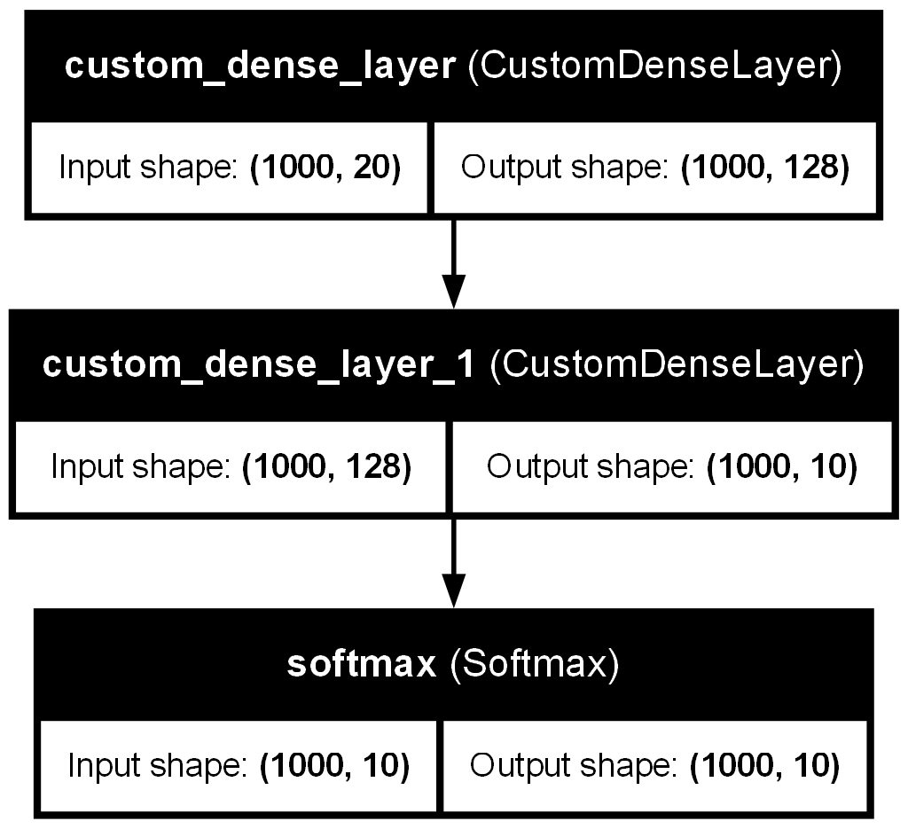

# Keras Custom Layers

This project explores how to define, use, train, and visualize a custom neural network layer in TensorFlow/Keras.

## Overview

In this notebook, I built a custom dense layer by subclassing `Layer` and then integrated it into a `Sequential` model. I also compiled the model, trained it on randomly generated data, visualized the architecture, and finally modified the model by adding dropout for regularization.

---

### defining custom layer

I created a custom layer called `CustomDenseLayer` by inheriting from `tensorflow.keras.layers.Layer`.

Inside this layer:

- `__init__()` stores the number of output units.
- `build(input_shape)` creates the trainable parameters:
  - a weight matrix `self.w`
  - a bias vector `self.b`
- `call(inputs)` defines the forward pass:
  - matrix multiplication with `tf.matmul(inputs, self.w)`
  - adding the bias term
  - applying `tf.nn.relu(...)`

This means the layer behaves like a manually implemented dense layer with ReLU activation.

---

### integrating custom layer into the model

After defining the custom layer, I integrated it into a `Sequential` model.

The first model uses:

- `CustomDenseLayer(128)`
- `CustomDenseLayer(10)`
- `Softmax()`

This shows that a custom layer can be used just like built-in Keras layers inside a model architecture.

---

### compiling the model

Next, I compiled the model using:

- optimizer: `adam`
- loss: `categorical_crossentropy`

I also printed the model summary before and after explicitly building the model. This helps show how Keras tracks shapes and parameters once the input size is known.

---

### training the model

To train the model, I generated random sample data:

- `x_train` with shape `(1000, 20)`
- `y_train` as random class labels from 10 categories

Then I converted the labels to categorical format and trained the model.

This part demonstrates the end-to-end workflow of fitting a model that contains custom layers.

---

### Visualizing architecture

I visualized the model architecture using `plot_model(...)` from `tensorflow.keras.utils` and saved the output as an image.

The generated architecture image is included in this repository:



This diagram provides a visual summary of the model structure created in the notebook.

---

To prevent overfitting, I add a dropout layer

In the final part of the notebook, I modified the architecture by adding a dropout layer.

The updated model includes:

- `CustomDenseLayer(64)`
- `Dropout(0.5)`
- `CustomDenseLayer(10)`
- `Softmax()`

This version demonstrates how dropout can be inserted into a model containing custom layers to reduce overfitting.

---

## Files

- `Keras-customLayers.ipynb` — main notebook containing the implementation
- `model_architecture.png` — saved architecture visualization
- `README.md` — project description

---

## Summary

This project covers the full workflow of working with custom layers in Keras:

- defining a custom layer from scratch
- integrating the custom layer into a model
- compiling and training the model
- visualizing the architecture
- updating the model with dropout for regularization

Overall, this notebook is a hands-on exercise for on how Keras layers work internally and how custom layers can be combined with the standard TensorFlow/Keras pipeline.
```
